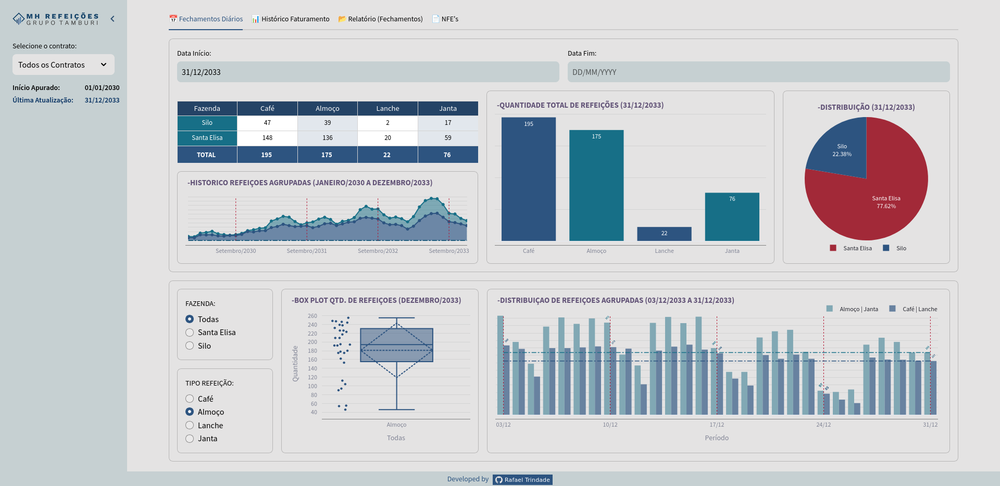
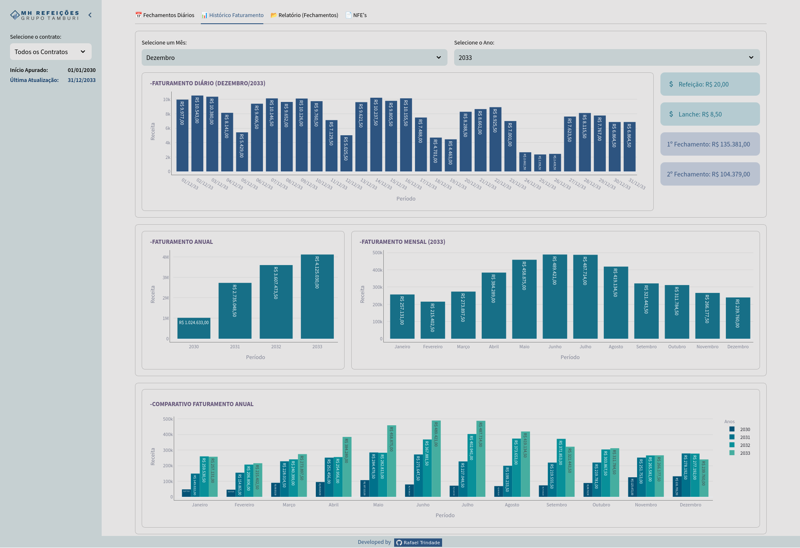
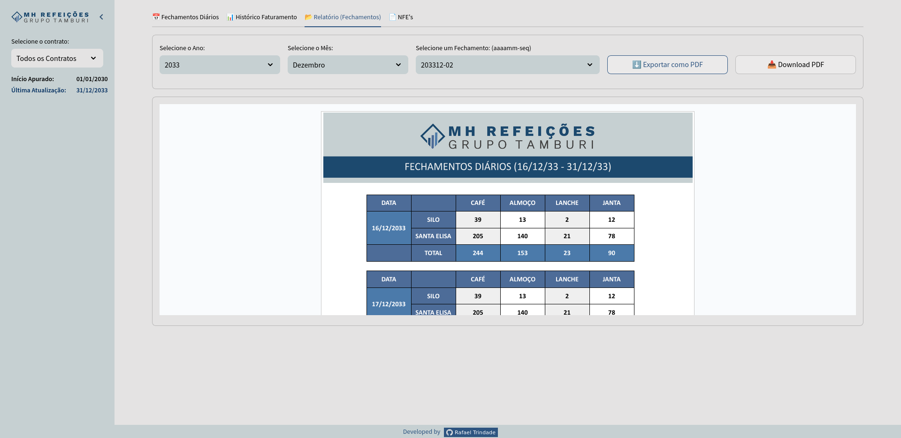
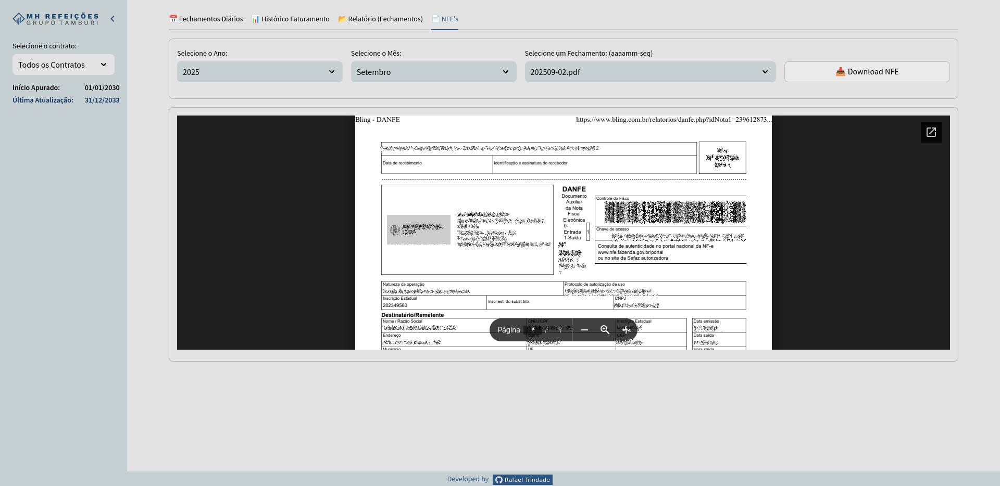

# Controle B2B | Grupo Tamburi

Dashboard | App desenvolvido para que o cliente contratante acompanhe quantidades de refeições fornecidas, documentos e relatórios. Versão com dados fictícios gerados por  [`datafaker-rafatrindade`](https://github.com/rafa-trindade/datafaker-rafatrindade) para portfólio público.

## 📊 Funcionalidades

- Acompanhamento em tempo real das refeições fornecidas
- Visualização detalhada por unidade
- Histórico de fatueamnto
- Gráficos e relatórios interativos
- Filtros por período e unidade
- Download de relatório (fechamentos) no formato PDF
- Acesso a documentos como NFE's (com código de acesso)

Todos os dados e documentos são obtidos automaticamente a partir do drive corporativo, utilizando a API do Google Drive via secrets para leitura de arquivos no formato CSV e acesso seguro aos documentos armazenados.

## 📸 Capturas de Tela

#### - Painel Fechamentos

#### - Painel Histórico Faturamento

#### - Painel Relatório

#### - Painel NFE

